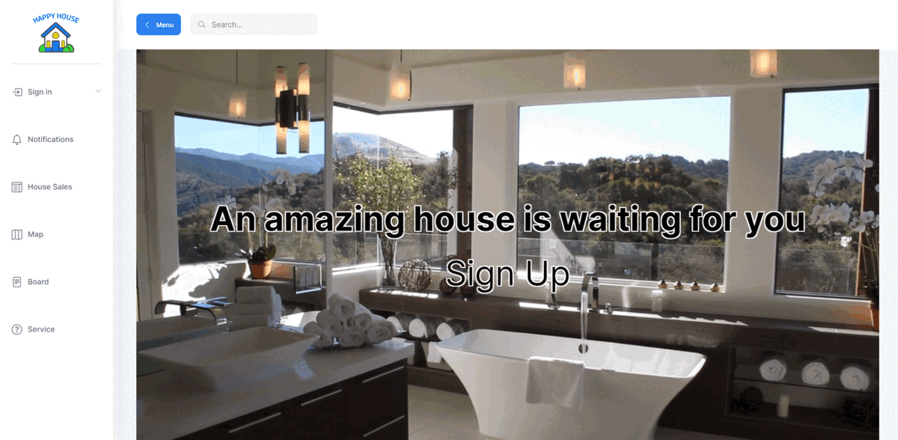

# HappyHouse


<br>

## 프로젝트 한줄 소개
**```부동산 정보 제공 웹 사이트```**

<br>

## 프로젝트 기획 의도
**```유저 친화적인 UI/UX로 부동산 정보를 쉽게 찾아보게 하기 위한 사이트```**

<br>

## 프로젝트 기간
2021-11-18(목) ~ 2021-11-25(목) 8일간

<br>

## 프로젝트 팀원
- 김범주 : 회원관련, 공지사항, 게시판, 뉴스 크롤링, 상담 채팅

- 김현민 : UI 및 디자인, 메인화면, 회원정보, 주변 상권, 아파트 매물, 아파트 평점

<br>

## 기술 스택
### Front-End
- Vue.js, BootStrap5, Kakao Map API, Socket.io

### Back-End
- Node.js, SpringBoot

### Database
- MySQL, MyBatis

### Etc.
- 공공데이터

<br>

## 주요기능
- 뉴스크롤링

- 카카오맵

- 집 거래 매물 추천

- 집 거래 매물 검색

- 집 주변 상가 정보 제공

- 상담톡

<br><br>

# 서비스 소개

<br>

# 메인화면

- 메인화면으로 이동시 마다 영상 3개가 랜덤하게 재생

- 중앙에 Sign Up 클릭 시 회원가입 창으로 이동 가능

<br>

## UI / UX

- 좌측 Menu를 누르면 사이드바 열리고 닫힘

- 통합 Search 게시판, 매물, 공지사항 화면에서 검색

- 유저 프로필 클릭시 Drop Down 메뉴

- 공지사항, 메세지 알림 기능 미구현

<br>


- 메인 로고

- 공지사항

- 매물 리스트, 거래 내역 보기, 매물 추천

- 지도와 함께 볼 수 있는 매물 리스트 및 주변 상권

- 게시판

- 고객 상담 실시간 톡 기능

<br>

# 회원 관리
## 회원 가입

- 이름, 이메일, 비밀번호, 비밀번호 확인 입력 후 회원가입 가능

<br>

## 로그인

- 이메일과 비밀번호가 일치하면 회원가입 가능

<br>

## 회원정보

- 유저 이미지를 클릭, View Profile 클릭하여 회원 정보창으로 넘어올 수 있음

- 왼쪽 상단 config 클릭 시 유저 정보 수정화면으로 넘어감

- 우측 상단에 회원이 관심매물로 등록한 것들 표시됨

- 현재 관심매물 표시는 되지만 관심 매물 삭제 미구현

- 우측 하단에 뉴스 크롤링 기능으로 뉴스 목록을 불러옴

- 뉴스 클릭시 해당 뉴스 페이지로 이동

- 관심지역 및 거래중인 매물 디자인 요소만 포함되어 있음

<br>

## 회원정보 수정

- 비밀번호 수정 가능
- 유저 이미지 수정 미구현


<br>

## 로그아웃
* 우측 상단의 유저 프로필 메뉴에서 Sign Out를 클릭하여 로그아웃 가능

<br>

## 회원탈퇴
* 회원정보 수정에서 탈퇴 버튼을 클릭해 회원탈퇴가 가능

<br><br>

# 공지사항

* DB에 직접 email이 admin / password가 admin 유저를 insert하고 로그인해서 진행
* admin 관리자 계정으로 로그인 시에만 글쓰기, 수정, 삭제가 가능
* 일반 유저는 공지사항을 읽는 것만 가능
* 상단 Search 창에서 검색 후 Enter 입력 시 해당하는 공지사항을 검색 가능

<br>

## 공지사항 글쓰기

- 관리자 일 경우만 메인화면 하단부에 글쓰기 버튼이 나타남
- 글쓰기 버튼 클릭시 이동 가능
- 관리자일 경우만 공지사항 작성 가능

<br>

## 공지사항 상세화면

- 공지사항 목록에서 글을 클릭하면 상세화면으로 넘어옴
- 관리자 일 경우만 하단에 수정 및 삭제 버튼이 나타남

<br>

## 공지사항 수정
* 글쓰기 화면과 동일

<br>

## 공지사항 삭제
* 상세화면에서 삭제가 가능

<br><br>

# 매물 목록

## 매물 추천
- 상단에는 매물 목록 화면으로 넘어올 때마다 거래 가능한 매물 4가지 추천

- 별점이 4점 이상이고 상태가 판매중 또는 취소됨 매물 4가지를 랜덤하게 추천

- 최근 거래 금액과 이전 거래의 시세 차이 %와 최근 거래 날짜를 표시

<br>

## 매물 검색
- 매물 검색 시 사진, 평균시세, 평균평수, 건축년도, 별점, 상태 정보를 표시

- 상단에 Search 창에서 해당하는 매물 검색

- 시/도, 구/군, 동을 선택하여 해당하는 매물 검색

- 단, 현재 서울 지역의 매물 정보만 제공

- 검색된 매물의 판매중, 취소됨, 계약중, 계약됨을 선택하여 검색

- 매물 클릭 시 해당 매물 거래 목록을 표시

<br>

## 매물 정렬
- 이름, 건축년도, 평균가격, 평균평수 에 따라 오름차순, 내림차순으로 정렬 가능

<br><br>

# 카카오맵

## 매물 검색
- 위치와 추가 조건에 따른 매물 검색 및 정렬 기능을 제공

- 검색 시 해당 매물의 위치를 지도에 표시

- 검색 된 매물 아이콘 클릭 시 상세한 정보 표시

<br>

## 근처 상가
- 검색 된 부동산 매물의 옵션을 클릭하여 500m 근방의 상가를 표시

- 검색된 상가들은 8가지 분류에 따라 다른 아이콘으로 표시

- 검색 된 상가 아이콘 클릭 시 상세한 정보 표시

<br><br>

# 게시판

* 기본적인 기능과 UI/UX는 공지사항과 동일

* 글쓴 사람만 수정과 삭제가 가능

* 상단 Search 창에서 검색 후 Enter 입력 시 해당하는 게시판을 검색 가능

<br><br>

# 상담톡


* 상담톡이 완전하게 구현 된 것이 아닌 Socket통신을 통해서 같은 Local PC에서 가상 상담톡을 구현

* 실행 순서
    1. FrontEnd README의 npm 목록 설치 필수

    2. VSCode에서 터미널을 하나 더 만들어서 Frontend 내의 backend 폴더로 경로 설정

    3. npm start - 커넥션 기록이 갱신되면 성공

    4. 3의 터미널은 실행두게 두고, 다른 터미널로 넘어옴

    5. 기존 FrontEnd 단 실행 - 루트 폴더에서 npm run serve

    6. HappyHouse 창 두개를 실행 한 뒤 채팅, 통신

<br><br>

# ERD


<br><br>

# 프로젝트 결과 정리

## 핵심 요소
- 매물 API : 공공데이터를 사용하여 매물 목록을 보여줌

- 카카오맵 API : 카카오 맵을 통해 매물의 위치 정보를 한눈에 파악할 수 있게 만듬

- Socket.io : 소켓 연결을 통해 채팅 기능을 구현.

- 크롤링 : 뉴스 크롤링을 통해 뉴스를 보여줌.

<br>

## 기대효과
- 웹 개발의 전반적인 프로세스를 알게된 좋은 프로젝트 경험이었음.

- Vue를 광범위하게 활용했던 경험을 통해 프론트엔드 분야의 숙련도가 크게 올라갔음을 느낄 수 있었음.

- 기존에 몰랐던 Api 사용법이나 소켓 등을 학습함으로써 다음에 있을 프로젝트에 더 나아진 기능의 구현이 가능할것이라 예상됨

- MyBatis 프레임워크를 통해 SQL Query문 사용법을 익힘으로써 다음 프로젝트에서 조금 더 복잡한 Query문 구현이 가능할 것이라 예상됨.

<br>

## 프로젝트 회고록
### 김범주 
- 오래간만에 프로젝트로 밤을 새워가며 만들어봤습니다. Vue가 재밌었다가 VueX에 와서 갑자기 어려워진 느낌이 있었는데, 이번 프로젝트를 진행하면서 여러 분야로 Vue를 사용하므로써 웹을 보는 눈이나 Vue를 사용하는 스킬이나 많이 늘어난 것 같아 좋았습니다.

<br>

### 김현민
- 관통 프로젝트를 통해 일정관리의 중요성, 문서작업의 중요성을 깨닫게 되는 시간이었습니다.

- 굉장히 짧은 시간동안 구현할 수 있는 내용은 많지 않았지만 스스로 욕심을 좀 많이 내서 많은 것들을 구현하려고 했다. 하지만 모든 기능들을 완성하진 못했다. 초기에 일정관리를 제대로 하여 어느 선 정도로 할 수 있는지를 깨닫고, 일정에 맞추어서 개발을 했으면 효율성이 더 올라갔을 것이라고 생각된다.

- 또 하나 개인적으로 아쉬운 점은 개발 초기 단계에 페어와 함께 머리를 맞대어, 개발 문서를 제대로 작성하여 개발을 진행했어야 했는데, 단순한 아이디어 정리만으로 개발을 진행하다보니, 프로젝트를 갈아 엎는 수준까진 아니지만, 중간중간 수정 사항이 많아 굉장히 애를 먹었다.

- 아쉬운 점이 많은 프로젝트였지만, 그대로 페어와 함께 굉장히 고되지만 즐거운 시간을 보냈다.
